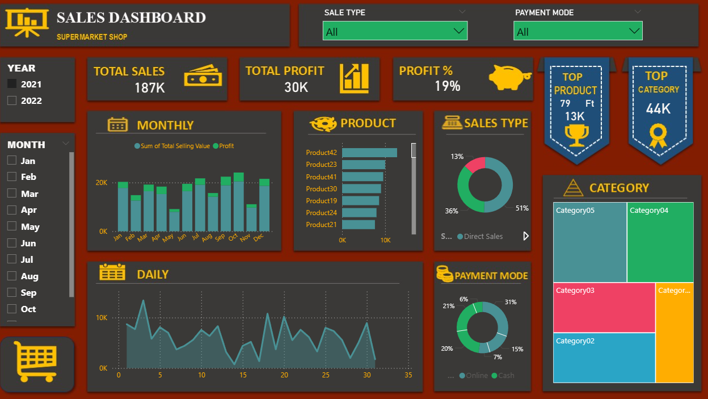

## 📊 Superstore Sales Dashboard

📌 Overview
This project presents a **Sales Dashboard** built in **Power BI** using a supermarket dataset.  
The dataset includes:
- **Input Data**: Daily sales transactions (date, product ID, quantity, sale type, payment mode, discount).
- **Master Data**: Product catalog (product name, category, unit of measure, buying price, selling price).

By combining these tables through proper data modeling, the dashboard provides a **comprehensive view of sales performance, profitability, and customer behavior**.

🔑 Key Features
- **KPIs at a glance**:
  - Total Sales: 187K  
  - Total Profit: 30K  
  - Profit %: 19%  

- **Trend Analysis**:
  - Monthly bar chart showing sales and profit trends across Jan–Dec.
  - Daily line chart to monitor short‑term fluctuations.

- **Product Insights**:
  - Ranking of top products (e.g., Product42, Product23, Product41).
  - Highlight of the single top product (Product79 with 13K sales).

- **Category Analysis**:
  - Treemap visualization of five categories (Category01–Category05).
  - Identification of top category (Category44K contribution).

- **Sales Type Breakdown**:
  - Donut chart showing distribution: 51% Direct Sales, 36% Online, 13% Wholesaler.

- **Payment Mode Insights**:
  - Donut chart showing customer preferences: Cash (31%), Online (21%), Card (20%), Other (15%), Miscellaneous (7%), Unknown (6%).

## 🛠 Tools & Techniques
- **Power BI**: Dashboard design and interactive visuals.
- **Excel**: Input/master data preparation.
- **Data Modeling**: Relationships between transactional and master tables.
- **Business Logic**:
  - Sales = Selling Price × Quantity  
  - Profit = (Selling Price – Buying Price) × Quantity  
  - Profit % = Profit ÷ Sales × 100  

## 📈 Business Impact
This dashboard enables supermarket managers to:
- Track **overall sales and profitability** trends.
- Identify **top‑performing products and categories**.
- Understand **customer preferences** in sales channels and payment modes.
- Make **data‑driven decisions** for inventory planning, pricing strategies, and marketing focus.

---

## 🚀 How to Use
1. Clone or download this repository.
2. Open the `.pbix` file in **Power BI Desktop**.
3. Explore the dashboard with filters (Year, Month, Sale Type, Payment Mode).
4. Review KPIs, charts, and insights interactively.

## Screenshots

